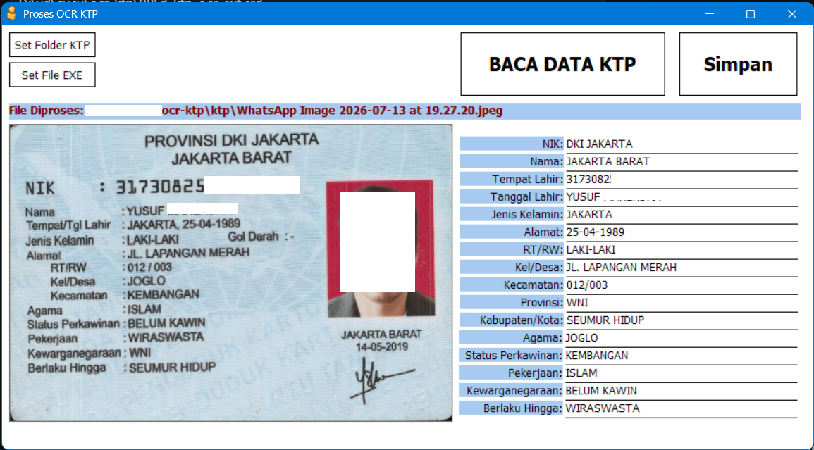
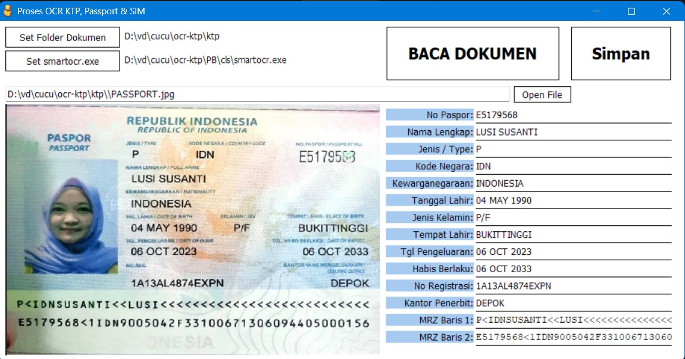

# Smart Document OCR Utility



This repository contains the standalone C# executable `smartocr.exe` for extracting text from Indonesian documents (KTP, Passport, SIM, etc.) utilizing the built-in Windows 10/11 Offline OCR Engine.

## Features
- **100% Offline**: Runs locally on your machine with no internet connection required.
- **Fast Execution**: Uses native Windows APIs for rapid text extraction.
- **No Setup Required**: Standalone executable.

## Usage
Run the utility from Command Prompt or PowerShell, passing the absolute path to your image document:

```cmd
smartocr.exe "C:\path\to\document.jpg"
```

## PowerBuilder 10.5 Integration & Cloud AI Engine
Untuk mendapatkan:
- Versi Cloud AI Engine (Akurasi tinggi, otomatis membedakan KTP/Passport/SIM, dan mengembalikan output terformat pipa `|` untuk kolom-kolom data).
- Kode contoh PowerBuilder 10.5 (file PBL library, Window `.srw` dinamis, dan template DataWindow `.srd`).
- Bantuan integrasi penuh ke aplikasi Anda.

**-- JIKA INGIN GUNAKAN AI MODE --**
Kontak Developer di WA **0851-7172-1782** atau langsung hubungi saya melalui akun GitHub ini (Hermawan Dony).

### Demo Documents (KTP, Passport, SIM)
*Catatan: Gambar contoh Passport dan SIM ini diambil dari Google Images hanya untuk keperluan pengujian (testing) fitur aplikasi. Karena dokumen tersebut bersifat publik di internet, data di dalamnya tidak memerlukan sensor privasi khusus.*

Berikut adalah visualisasi hasil pembacaan dokumen pada aplikasi PowerBuilder menggunakan utilitas ini:

- **Passport Sample**:
  

- **SIM Sample**:
  
