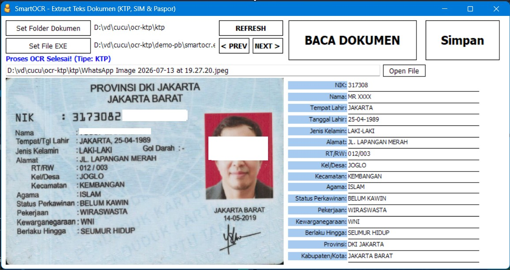
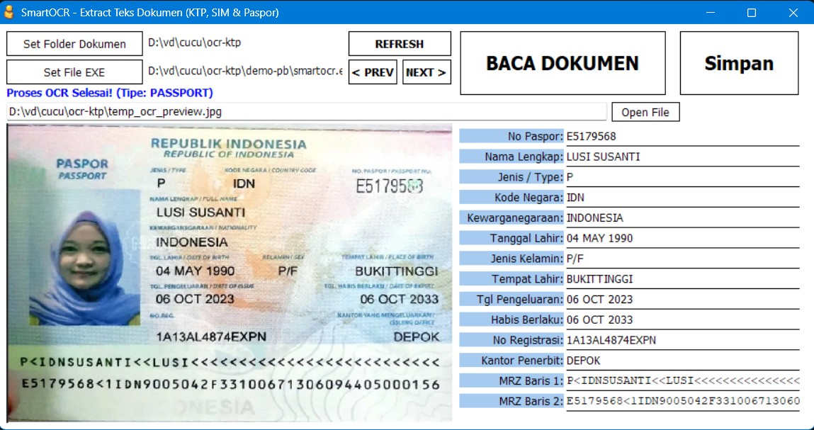
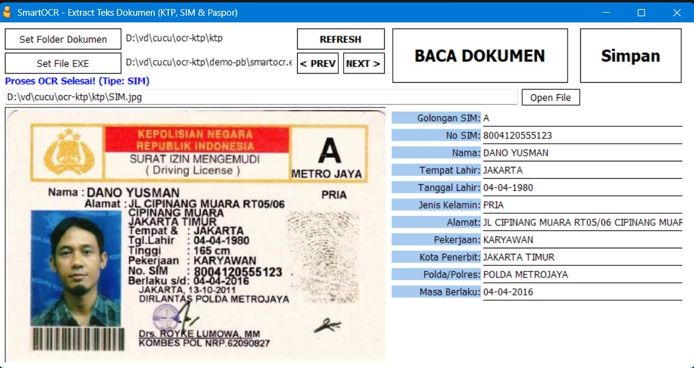
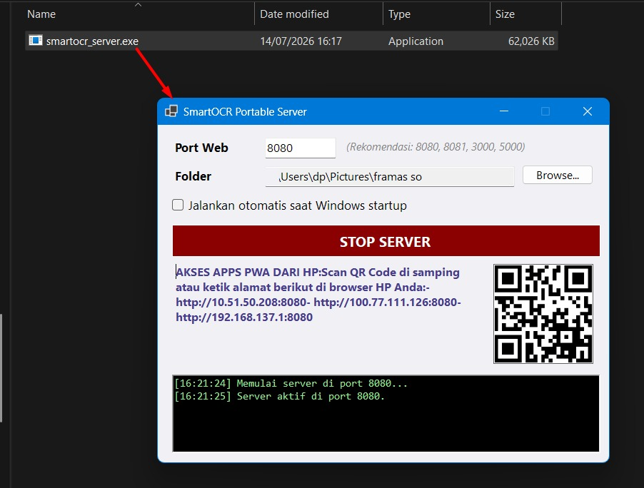
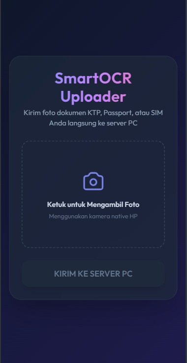

# Smart Document OCR Utility


This repository contains a unified C# utility (`smartocr.exe`) for extracting structured data from various Indonesian documents.

### Supported Documents (Current Features):
- **KTP** (Indonesian e-KTP)
- **PASSPORT** (Indonesian Passport)
- **SIM (A, B, C)** (Indonesian Driver's Licenses)
- *Can be extended further in the future as needs arise.*

It supports both a fast, 100% offline Native Windows OCR, and a high-accuracy Cloud AI engine.

---

## The `smartocr.exe` Utility (CLI)
`smartocr.exe` is designed to be easily called from legacy systems like PowerBuilder. It accepts two parameters:
1. **Image Path**: The absolute path to the KTP/Passport/SIM image.
2. **Secret Code** (Optional): Passing `"wawn1782"` activates the High-Accuracy Cloud AI mode.

### Usage
```cmd
smartocr.exe "C:\path\to\document.jpg" [secret_code]
```

#### Offline Mode (Default)
If you run without the secret code, the utility automatically runs 100% offline using local Windows OCR.
- **Command:** `smartocr.exe "C:\path\to\document.jpg"`
- **Pros:** 100% offline, requires no internet connection, extremely fast.
- **Cons:** Accuracy drops on blurry text. Outputs raw multiline text instead of formatted pipes.

#### Cloud AI Mode
If you pass the secret code `"wawn1782"`, it activates the AI engine (`agy.exe`) for advanced processing.
- **Command:** `smartocr.exe "C:\path\to\document.jpg" wawn1782`
- **Pros:** 100% accurate, automatically formats data into structured pipe-delimited (`|`) values, immune to bad fonts or blurry text. Supports KTP, Passport, and SIM.
- **Cons:** Requires an active internet connection.

### Output Format (Mode 1 / AI)
The application outputs a single line of text, delimited by a pipe character (`|`). The first column specifies the detected document type.

- **KTP (17 Columns):**
  `KTP|Provinsi|KabupatenKota|NIK|Nama|TempatLahir|TanggalLahir|JenisKelamin|Alamat|RtRw|KelDesa|Kecamatan|Agama|StatusPerkawinan|Pekerjaan|Kewarganegaraan|BerlakuHingga`

- **PASSPORT (15 Columns):**
  `PASSPORT|NoPaspor|NamaLengkap|Jenis|KodeNegara|Kewarganegaraan|TanggalLahir|JenisKelamin|TempatLahir|TanggalPengeluaran|TanggalHabisBerlaku|NoReg|KantorPengeluar|MRZ1|MRZ2`

- **SIM (12 Columns):**
  `SIM|GolonganSIM|NoSIM|Nama|TempatLahir|TanggalLahir|JenisKelamin|Alamat|Pekerjaan|KabupatenKota|PoldaPenerbit|BerlakuHingga`

## PowerBuilder Integration
The library files and workspaces are packaged inside the `demo-pb` directory. 
- You can open the PowerBuilder workspace (`ocrktp.pbw`) and target library (`ocr.pbl`) directly using **PowerBuilder 10.5**.
- It contains templates for KTP (`d_ktp_ocr_ext`), Passport (`d_passport_ocr`), and SIM (`d_sim_ocr`) layouts.
- Sample scripts and code snippets for invoking the OCR tool from custom events are documented in `pb_script.txt`.

### Demo Documents for Testing
The `demo-pb` folder contains sample files that you can use to test the OCR engine.

*(Note: The sample passport and driver's license images utilized for testing are sourced from public search engines like Google Images. Since these documents are publicly accessible on the internet, they do not require special privacy redaction).*

- **KTP Sample**:
  

- **Passport Sample**:
  

- **SIM Sample**:
  

---

## The `smartocr_server.exe` Utility (Portable PWA Server)
`smartocr_server.exe` is a lightweight, standalone C# WinForms application that acts as a self-hosted Web Server & API. It hosts a **PWA Mobile Web App** that allows sales/operators to capture document photos (KTP, Passport, SIM) with their smartphone cameras and upload them directly to a folder on your Windows PC.

### Screenshots
- **Desktop Server Interface**:
  

- **Mobile PWA Interface**:
  

### Features
- **No Setup Required**: Standalone executable, no IIS/Apache/Nginx or Database required.
- **Customizable Port & Path**: Set your preferred port and local storage folder via the UI.
- **Windows Boot Autorun**: Easily check the checkbox to configure the app to run automatically on Windows startup.
- **QR Code & IP List**: Generates a QR Code on startup. Scan it with a smartphone to launch the web app instantly.
- **PWA Compatibility**: Can be installed to the home screen of iOS and Android devices as a standalone mobile app using native camera interfaces.
